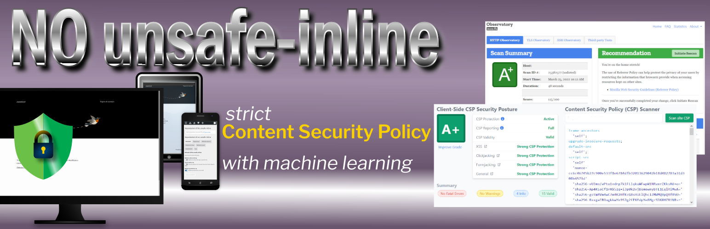

# No unsafe-inline #

**No unsafe-inline** is a security plugin for WordPress that helps you to build a Content Security Policy avoiding to use 'unsafe-inline' and 'unsafe-hashes'.

**Install it now:**
[https://wordpress.org/plugins/no-unsafe-inline/](https://wordpress.org/plugins/no-unsafe-inline/)

## Description ##

Content Security Policy (CSP) is a computer security standard introduced to prevent cross-site scripting (XSS), clickjacking and other code injection attacks resulting from execution of malicious content in the trusted web page context.
Cross-site scripting (XSS) is a type of security vulnerability that can be found in some web applications.
XSS attacks enable attackers to inject client-side scripts into web pages viewed by other users.
A cross-site scripting vulnerability may be used by attackers to bypass access controls like the same-origin policy.
Looking at National Vulnerability Database ran by US NIST, *more than 1,600 vulnerabilities* are reported as [XSS for Wordpress' plugins and themes](https://nvd.nist.gov/vuln/search/results?form_type=Basic&results_type=overview&query=XSS+Wordpress&search_type=all&isCpeNameSearch=false).

*Keeping your site up-to-date* with the latest versions of plugins and themes is the **first** line of defense to ensure your site's security.

The second thing to do, is to **deploy a strict Content Security Policy**.

### The main problem ###
The main problem with Content Security Policies implemented in the real world is that [they are too weak to really protect your site](https://research.google/pubs/pub45542/) and that many of them can be trivially bypassed by an attacker.

### The proposed solution ###
Google researchers recommend, instead of whole host whitelisting, to activate individual scripts via a CSP nonces approach.
In addition, in order to faciliatate the adoption of nonce-based CSP, they proposed the ’strict-dynamic’ keyword.

### The problem(s) with CSP in Wordpress ###
1. Manual creation of a policy
	
	Usually, a WordPress project is a mix of code written by different authors who contributed to the Core and or wrote plugins and themes.
	If it is possible to whitelist every external script loaded from a `
		
	and in your script-src directive:
		
		script-src 'nonce-rAnd0m';
		
	And, of course, a nonce must be unique for each HTTP response.
4. Unsafe hashes / Inline styles

	Sometimes, HTML elements as images or button uses HTML Event Attributes (onclick, onsubmit...) to let events trigger actions in a browser.
	You cannot use hashes or nonces for script included in event attributes and, adopting a strict CSP, requires refactoring those patterns into safer alternatives or to use 'unsafe-hashes'.
	You got a similar problem when inline styles are used in HTML tags:

		<h1 style="color:blue;text-align:center;">This is a heading</h1>
		
This is a paragraph.

	CSP Level 2 browsers may be ok with just putting the hash in your style-src directive. However, to allow hashes in the style attribute on inline CSS on browsers that support CSP Level 3, you may get an error like this

		`Refused to apply inline style because it violates the following Content Security Policy directive: "style-src 'self' 'sha256-nMxMqdZhkHxz5vAuW/PAoLvECzzsmeAxD/BNwG15HuA='". Either the 'unsafe-inline' keyword, a hash ('sha256-nMxMqdZhkHxz5vAuW/PAoLvECzzsmeAxD/BNwG15HuA='), or a nonce ('nonce-...') is required to enable inline execution.`

	To allow inline styles you need to use 'unsafe-hashes' in your style-src directive (that is, in facts, unsafe).

### This plugin approach ###
This plugin affords those problems in this way.
1. During a capture phase, it detects the scripts, styles and other embedded content present in the pages of your site and stores them in the database.
2. Then you have to whitelist these contents from plugin admin.
3. The plugin uses machine learning to cluster inline scripts trying to aggregate scripts generated by the same server side (PHP) code. So, you can authorize one script example to authorize all scripts that the classifier predicts to label as whitelisted clusters.
4. You can choose to use hashes to authorize external sources (and the plugin will allow you to include Subresource Integrity in your `<script>` and `<link>`)
5. You can use hashes or nonces to authorize inline scripts.
6. You can ask the plugin to refactor your page to not use event attributes (converted in a inline script) and inline styles (converted in an internal CSS).
7. You can set one or more violations' report endpoints.

The plugin supports multisite installations and has (too) many options documented in inline help.

### Creating a Content Security Policy ###

After plugin activation, go to Settings menu and search for CSP Settings submenu.
The steps you are supposed to do are the following.
1. From the Tools tab, activate the capture of the tags and use your site by visiting all the pages or making them visits from your users 
for a long time long period based on the use of your site (hours or days).
2. From the Tools tab perform the data clustering in the database (it can use many server resources).
3. Go to the Base rules tab and include in the CSP directives the desired values ​​(help you with the table at the bottom of the page).
4. Go to to external scripts tab, inline scripts tab and scripts invoked by event handlers tab and authorize the execution of all the legitimate scripts present on the pages of your site.
5. Leaving the tag capture active, activate the policy test (at this stage the plugin will generate some violations of the temporary policy used to record additional values to be included in the directives of your "content security policy").
6. After visiting again your site pages, disable the capture of the tags and repeat the previous steps 2, 3 and 4.
7. Enable site protection.

N.B. When you update plugins or themes, if something doesn't work properly on your site pages, temporarily deactivate the protection and repeat steps 1 to 7.

## Frequently Asked Questions ##

### Is this plugin easy to use? ###

This is not a click and go tool, but you can follow the instructions and implement a strict CSP.

### Has this plugin been widely tested? ###

No.

### Will this plugin impact site's performance? ###

During capturing phase this plugin needs to write many data to database, so your site can slow down.
When the plugin enforces the CSP, it uses a mu-plugin to capture the output of the WordPress process, manipulate it and then send to browser.
I don't have any measure of inherent overhead.

### Is there another way to implement a strict content security policy in WordPress ###

Not in my knowledge.

### Do you offer professional support for this plugin? ###

No. But I do my best to offer free support on wordpress.org support forum in my spare time.

### Do you offer professional support for CSP? ###

No.

## Screenshots ##

||||||
| :---: | :---: | :---: | :---: | :---: |
| Plugin's tools tab in a multisite enviroment | External scripts tab | Inline scripts/styles tab | List of CSP directives managed in Settings tab | A database summary table at the bottom of tools tab |

## Code and libraries ##
This version of the plugin uses:
* [ivopetkov/HTML5DOMDocument](https://github.com/ivopetkov/html5-dom-document-php) to parse HTML;
* [RubixML](https://rubixml.com/) for machine learning ***from version 1.1.0*** - _[PHP-ML](https://php-ml.readthedocs.io/en/latest/) was used in versions 1.0.x_;
* [opctim/php-nilsimsa](https://github.com/opctim/php-nilsimsa) to calculate and compare Nilsimsa digests;
* [spatie/async](https://github.com/spatie/async) to perform asynchronous and parallel PHP.

The log functions have been taken from
* [perfectyorg/perfecty-push-wp](https://github.com/perfectyorg/perfecty-push-wp), ***something you should [really try](https://wordpress.org/plugins/perfecty-push-notifications/) if you want to implement web Push notifications in your site.***

The **complete list of dependencies** used in this plugin can be seen in [dependency graph](https://github.com/MocioF/No-unsafe-inline/network/dependencies) on GitHub.

## License ##

No unsafe-inlie is an Open Source project licensed under [GPL v2](./LICENSE.txt).

## Contributions, Issues, Bugs ##

Plugin code is hosted on a public repository on [GitHub](https://github.com/MocioF/No-unsafe-inline).
Reach me over there to help and suggest.

## Open Source contributors ##

|  |
| :---: |
| [MocioF](https://github.com/MocioF) |
